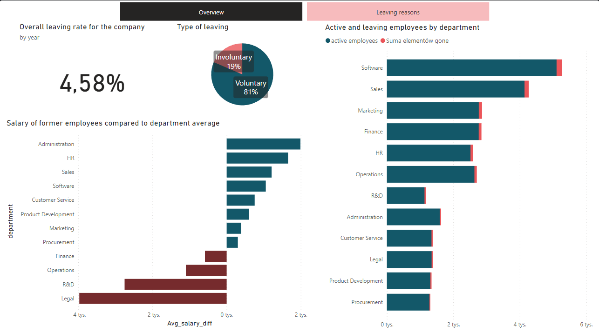
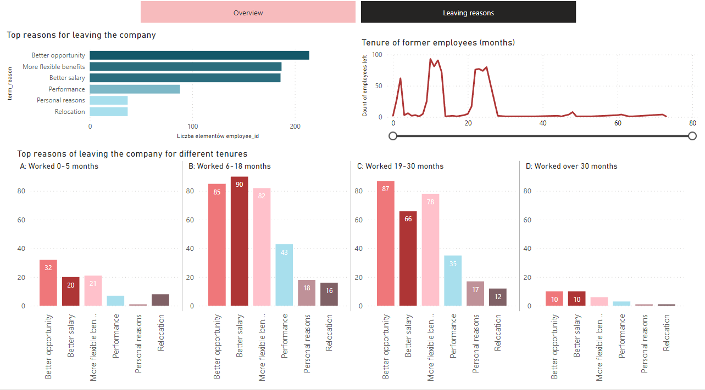

# HR Insights - Data in Motion Challenge

<br><br>
This is my very first project in Power BI being also my first practical contact with this tool. <br>
I decided to learn-by-doing and recreate a dashboard I previously made in Tableau.
<br><br>
See the full report at <a href="https://www.novypro.com/project/hr-insights">Novypro</a>.<br><br>

## Tools used:
Power Query, Power BI, BigQuery, SQL

## Contents:
* [The project](#the-project)
* [The data](#the-data)
* [The report](#the-report)

## The project
- <b>General project purpose:</b> learn how to use Power BI in practice<br>
- <b>Project idea:</b> Visualization challenge "People analytics" from <a href="https://d-i-motion.com/courses/data-viz-challenges/#learndash-course-content">Data in Motion</a>.<br>
- <b>Objective:</b> show insights from a given dataset on report of max 2 pages.<br>
- <b>Dataset:</b> <a href="https://docs.google.com/spreadsheets/d/1Dg_aczyeCh0izhIrZhVDCfuKqSApjMCV7flxaY6iUnA/edit#gid=423853547">see raw table in Google Sheets</a>.

## The data:
I decided to focus on employees leaving the company and make a dashboard that would help the management to choose the right strategy to retain valuable employees and keep low staff turnover.<br>
<br>
Data preparation:
- deleting columns that are unnecessary or even illegal for the employer to store (race, orientation, marital status),
- deleting columns I knew I wasn't going to use (age, IDs of higher level managers),
- setting appropiate data types etc.<br>

As I decided to focus on information about employees leaving the company, I wanted to find a percentage of people leaving from all departments and subdepartments, for each year. It could surely be done in DAX, but since I was a Power BI newbie, I had to find some other way. My solution was to load the table to BigQuery and use SQL to find the values. 
<br>
So, here's the query showing the number of employees working in each department and subdepartment in each year.<br>
Luckily the GoogleSQL syntax is only slightly different from the typical SQL (note the EXTRACT function).

```sql
WITH years AS
(SELECT
  employee_id,
  department,
  sub_department,
  EXTRACT(year from hire_date) AS hire_year,
  EXTRACT(year FROM term_date) AS term_year
FROM HR_insights.EMP)
SELECT 
  "2022" as year,
  department, 
  sub_department, 
  count(employee_id) as active_workers
  FROM years
WHERE hire_year <= 2022 AND (term_year >= 2022 OR term_year is null)
group by department, sub_department
```
<br><br>
I also needed a number of employees that left every year, but this time I simply made a table vizualisation with the values I needed and exported its results to CSV file. Then it was just a few clicks to join it all in Power Query and get the values I was looking for. It may be not the best way to do it, but worked fine for the absolute beginner. at the time of writing this documentation I already know how to do it with DAX :)
<br>
## The report
<br><br>
One look at the dashboard and the manager can see the employee turnover level and the fact that over 80% of dismissals were voluntary.<br> Does a salary play a role here? Looks like it depends on the department. Two of them stand out for their difference between the salary of current and former workers.<br><br>
<br><br>
Looking at the tenures of former employees we can clearly see a pattern: three peaks of when do people leave. I grouped them into 4 categories and checked their reasons for a job change: looks like every group has some different reasons, and "better salary" isn't the most important one.<br>
<br>
For sure there were much more insights to show from this dataset, but the requirements said clearly "two pages max". <br> 
This report helped me to become confident with the Power BI interface and to create visualizations looking the way I wanted. But now I'll leave it as it is and move on to something more challenging.<br><br>
Thank you for reading!
